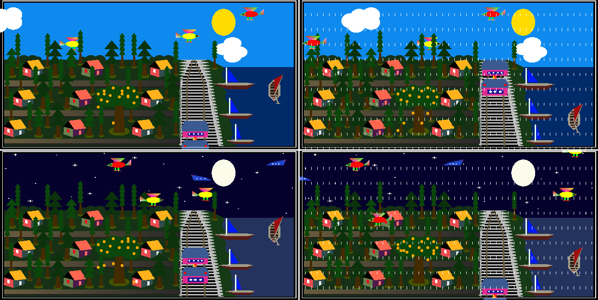
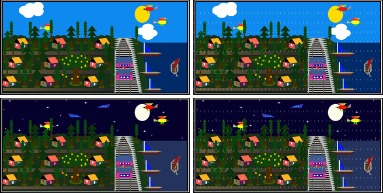

# Dream Village — an immediate-mode OpenGL scene, ported and made testable

[](https://github.com/Shayan-Amz/OpenGL-Dream-Village/actions/workflows/ci.yml)
[](src/scene.cpp)
[](src/main.cpp)
[](.github/workflows/ci.yml)
[-yellow)](NOTICE)

An animated 2-D village — houses, orchards, a railway, a river with boats,
birds, planes, clouds and rain — drawn with the OpenGL 1.1 fixed-function
pipeline, in four scenes (day, rain, night, rain at night).

<p align="center">
  
  <br><sub>The four scenes as drawn by the real OpenGL build — Visual Studio 2022, Release | x64, captured with <code>p</code>.</sub>
</p>

<p align="center">
  
  <br><sub>The same four scenes rendered <em>head-less</em> with no GPU at all, by the software rasteriser in <a href="tools/softgl">tools/softgl</a> — these are the reference frames the regression tests compare against.</sub>
</p>

> **Provenance.** The scene geometry was authored by **Krishno Dey** and
> published as [krishnodey/Dream-Village](https://github.com/krishnodey/Dream-Village)
> (2020, Code::Blocks / MinGW, no licence).  This repository started as a port
> of that program to Visual Studio 2022 and grew into an exercise in taking an
> existing immediate-mode OpenGL program and making it **correct, portable and
> testable** without changing what it draws.  The original file is kept
> verbatim in [`legacy/`](legacy/); [`NOTICE`](NOTICE) states exactly what is
> whose.  The MIT licence covers only the code written here.

## What was done

| Area | Upstream / first port | This repository |
|---|---|---|
| Structure | One 2 000-line file; animation counters mutated *while drawing*; four copy-pasted scene functions | `dv::AnimationState` + `dv::advance()` (simulation) and `dv::render(Scene, state)` (pure drawing) in [`src/scene.cpp`](src/scene.cpp); front-end in [`src/main.cpp`](src/main.cpp) |
| Frame pacing | `for(int i=0;i<100000000;i++);` at the top of every frame (deleted by any optimising compiler) | `glutTimerFunc` at 30 ticks/s; `space` pauses |
| Buffering | `GLUT_SINGLE` + `glFlush()` (tearing) | double buffering |
| GL correctness | 5 – 605 `GL_INVALID_OPERATION` per frame (`glLineWidth` inside `glBegin/glEnd`, an unterminated `glBegin`), every ellipse drawn twice, a cloud that never wraps | 0 GL errors; 7 017 instead of 13 142 triangles per frame, identical pixels |
| Portability | `<windows.h>`, `<mmsystem.h>` (unused), MSVC only | Windows (VS 2022 + NuGet FreeGLUT), Linux (freeglut), macOS (GLUT.framework); CMake + the original `.sln` |
| Resizing | none — the window content distorts | letter-boxed 2:1 viewport |
| Output | — | `p` saves a PNG; `--screenshot DIR` renders all four scenes off-screen |
| Testing | — | [`tools/softgl`](tools/softgl): a software rasteriser for the used GL subset; the port is checked **pixel-for-pixel against the legacy program** in CI on three OSes |
| Hygiene | binaries (`main.o`, `freeglut.dll`), IDE state and a stray `main.c` committed | ignored/removed; `NOTICE`, `LICENSE`, `.clang-format`, `.editorconfig` |

The defect list with symptoms and fixes is in [`legacy/README.md`](legacy/README.md).

## How the scene works

**World.** An orthographic 100 × 100 unit square (`glOrtho(0,100,0,100,-1,1)`),
y up, shown in a 2:1 window; the design is therefore stretched 2:1 horizontally,
which is part of its look.  There is no depth buffer — painter's order is the
only visibility mechanism, and the scene is drawn back to front: sky (or night
sky), road and railway, village ground with houses and trees, river with boats,
a white border, and finally the rain overlay.

**Primitives.** Everything is built from `GL_QUADS`, `GL_TRIANGLES`, convex
`GL_POLYGON`s, `glRectf` and a 50-segment `GL_TRIANGLE_FAN` ellipse
(`circle(rx, ry, x, y)`), with per-vertex colours for the simple shading on
roofs and hulls.  A day frame is ≈ 7 000 triangles and ≈ 1.25 M fragments at
1300 × 650 — trivially cheap, which is why the immediate-mode API is adequate
here even though it has been deprecated since OpenGL 3.0.

**Animation.** [`dv::AnimationState`](src/scene.h) holds every time-varying
quantity: the train and big-boat offsets along the diagonal rails/river, the
bobbing of the small boats, five cloud offsets, two horizontally flying birds,
two diagonally flying birds, two planes (night only), six falling oranges and
twelve rain layers.  `dv::advance()` steps each one by the increment the
original program used and wraps it, so one tick is one original frame.  The
drawing routines read the state through `glTranslate` and never modify it —
this is what makes a frame reproducible and therefore testable.

**Scenes.** `Scene::{Day, Rain, Night, RainNight}` select the sky, the river
palette and whether the rain overlay is drawn; everything else is shared.

## Building and running

### Windows — Visual Studio 2022

Open `DreamVillage.sln`, let NuGet restore `nupengl.core` (FreeGLUT headers,
import libraries and `freeglut.dll`), build **Release | x64**, run.  Or from a
*Developer Command Prompt*:

```bat
nuget restore DreamVillage.sln
msbuild DreamVillage.sln -p:Configuration=Release -p:Platform=x64
x64\Release\DreamVillage.exe
```

### Linux / macOS — CMake

```bash
# Debian/Ubuntu: sudo apt install build-essential cmake freeglut3-dev
# macOS: Xcode command-line tools (GLUT.framework is included, deprecated but functional)
cmake -S . -B build -DCMAKE_BUILD_TYPE=Release
cmake --build build --parallel
./build/dream_village
```

### Controls

| Input | Action |
|---|---|
| `d` `r` `n` `a` | day · rain · night · rain at night |
| left / right mouse button | rain at night · day |
| `space` | pause / resume |
| `p` | save the current frame as `dream_village_<scene>.png` |
| `q` / `Esc` | quit |
| `--screenshot DIR [--ticks N]` | render all four scenes off-screen after `N` ticks and exit |

## Testing without a GPU

Rendering is the program's only observable behaviour, and CI runners have no
GPU, display or vendor OpenGL.  Instead of mocking GL calls (which would test
nothing about the picture), [`tools/softgl`](tools/softgl) implements the used
subset of the fixed-function pipeline in software — matrix stacks, orthographic
projection, viewport transform, a half-space triangle rasteriser with
pixel-centre sampling and a top-left fill rule, Gouraud interpolation, lines,
`glReadPixels`, and the specification's error model.  The scene sources compile
unchanged against softgl's `GL/gl.h`.

Two tests run under `ctest` on Ubuntu, macOS and Windows (MSVC):

* **`headless_render_matches_legacy`** renders each scene twice — with
  `src/scene.cpp` and with the untouched `legacy/main.cpp` compiled into the
  same binary — and requires **zero differing pixels** (`--max-diff-ppm 0`).
  It also reports GL errors per frame, triangle and fragment counts and the
  fraction of the frame covered:

  ```
  scene       triangles fragments coverage errors  png legacy_err  draw_diff  draw_ppm  anim_diff
  day              7017   1248754    92.6%      0   ok          5          0       0.0          0
  rain             7017   1255347    92.7%      0   ok        605          0       0.0       6555
  night            6989   1219474    92.5%      0   ok          5          0       0.0       4320
  rain_night       6989   1225364    92.6%      0   ok        605          0       0.0      11456
  PASS
  ```

  `draw_diff` compares frames drawn from the *same* animation state (the
  drawing code is identical to the pixel); `anim_diff` additionally lets the
  port advance its own state and shows the intended divergence from the
  legacy animation (the fixed cloud wrap and the regularised rain — see the
  defect table).

* **`softgl_selftest`** checks the rasteriser itself against exact pixel counts
  (edge exclusivity, no double coverage across shared edges, Gouraud
  endpoints, matrix-stack errors, line lengths, error semantics).

```bash
ctest --test-dir build --output-on-failure
./build/render_headless --out out --compare        # writes out/{day,rain,night,rain_night}.png + legacy_*/diff_*
```

## Repository layout

```
src/
├── scene.h / scene.cpp     scene model: AnimationState, advance(), render(); the drawing routines
├── main.cpp                GLUT front-end: window, timer, input, screenshots
├── png_writer.h/.cpp       glReadPixels → PNG (stb_image_write)
└── gl_include.h            platform GL/GLUT include
tools/
├── softgl/                 software rasteriser (softgl.c, headers, self-test, README)
├── render_headless.cpp     head-less renderer + legacy comparison (CTest)
└── legacy_shim.cpp         compiles legacy/main.cpp into the test binary under a namespace
legacy/                     the program as received (verbatim) + defect table
third_party/                stb_image_write.h (public domain / MIT)
docs/figures/               rendered scenes used in this README
CMakeLists.txt              Linux/macOS/Windows build + tests
DreamVillage.sln/.vcxproj   Visual Studio 2022 solution (nupengl.core via NuGet)
.github/workflows/ci.yml    Ubuntu GCC · macOS Clang · Windows MSVC (VS solution + CTest)
```

## Limitations and possible extensions

* The scene uses the **immediate-mode API** (`glBegin`/`glEnd`), which is
  deprecated since OpenGL 3.0 and unavailable in core profiles.  A modern
  version would bake the static geometry once into a vertex buffer and draw
  the animated objects with per-object model matrices — the `AnimationState`
  split already isolates exactly the data such a renderer would need.
* Time is measured in **ticks**, not seconds; a very slow machine would slow the
  animation down rather than drop frames.  A `std::chrono`-based accumulator in
  `tick()` would decouple the two.
* softgl covers only what this scene needs (no depth test, blending or
  textures) and is intended as a test oracle, not as a general renderer.
* The design is authored for a 2:1 aspect ratio and simply letter-boxes
  otherwise; there is no high-DPI handling beyond what GLUT provides.

## References

* Mark Segal, Kurt Akeley, *The OpenGL Graphics System: A Specification, Version 1.1* — §2.6 Begin/End paradigm, §2.10 coordinate transformations, §3.4–3.5 line and polygon rasterisation, §2.5 GL errors.
* Juan Pineda, "A Parallel Algorithm for Polygon Rasterization", *SIGGRAPH 1988* — the half-space (edge-function) rasterisation used by softgl.
* Mark Kilgard, *The OpenGL Utility Toolkit (GLUT) Programming Interface, API Version 3* — timer, display and input callbacks; FreeGLUT documentation for the open-source implementation used here.
* Sean Barrett, `stb_image_write.h` — single-header PNG writer.

## License

Code written for this repository (everything outside `legacy/` and the
upstream-authored geometry in `src/scene.cpp`) — MIT, see [`LICENSE`](LICENSE).
Upstream geometry — © Krishno Dey, used with attribution, see [`NOTICE`](NOTICE).
